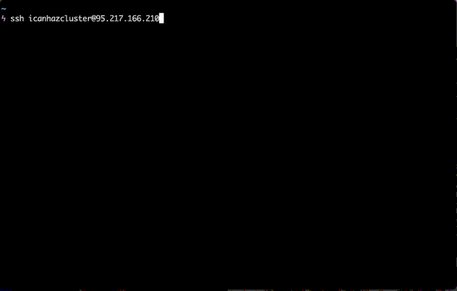

# K8s workshop in a box

This is a setup for running Kubernetes workshops using 'real' clusters,
without attendees having to install anything on their personal computers.

## How does it work?

This setup uses [Kind](https://kind.sigs.k8s.io/) to run a number of clusters isolated in Docker containers, on one big (cloud) server. Every participant of the workshop gets a 3 node Kubernetes cluster (one master two workers), running in 3 Docker containers per cluster.

The clusters are fully isolated, with their own internal IP space.

## Requirements

* A beefy (cloud) server. 
  * I used an AWS `m5.8xlarge` instance for a 15 person workshop, we had quite a bit of capacity left. Initialising the clusters is most resource intensive. Besides that it depends mostly on the workloads you're running during the workshop.
  * Running a three hour workshop costs about ~ 5$ this way. That's even cheaper than a pizza 🍕!
* Ubuntu 18.04 host OS. It may work with other Linux flavours, but the setup was only tested with Ubuntu 18.04 so far.
* SSH port open on the host node.

## Setup

1. Provision a host node, as described in Requirements above.
2. SSH into the node, clone this repository.
3. Run the `setup.sh` script with root privileges.
4. Create the desired number of clusters using `./create-clusters.sh <NUMEBR OF CLUSTERS>`. Best run this from screen/tmux as it will take a while (few minutes per cluster).
5. Done! 🙌

## Accessing the clusters

After the clusters are created, participants can 'provision' their own cluster via SSH:

```
ssh icanhazcluster@<CLOUD SERVER IP>
```

An SSH command to connect to your personal cluster will be printed.
Here it is in action:



## Caveats

* This is horribly insecure, using unauthenticated SSH (for ease of use). It's probably best to only allow SSH access from the IP address of your workshop venue.
* This was tested with up to 15 clusters.
* Use at your own risk :-) 